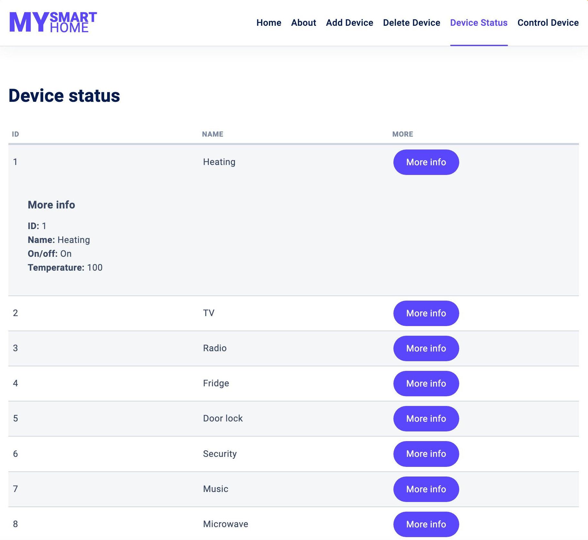

# PROJECT: MY SMART HOME WEB APPLICATION

The MySmartHome web application functions as a dashboard to help you control devices in your smart home.
The MySmartHome web application lets you control your devices by allowing you to turn on/off lights,
open/close doors, increase/decrease volume, regulate temperature, and so on, all in one place. You can also add and delete devices, set device preferences or view current status of each device.

## TABLE OF CONTENTS
1. [HOW TO USE THE APP](#HOWTOUSETHEAPP)
2. [HOW TO TROUBLESHOOT THE APP](#HOWTOTROUBLESHOOTTHEAPP)
3. [HOW WAS THE APP TESTED](#HOWWASTHEAPPTESTED)
4. [FILE STRUCTURE OF THE APP](#FILESTRUCTUREOFTHEAPP)
4. [CREDITS](#CREDITS)

### 1. HOW TO USE THE MYSMARTHOME 
- Install Express: 

		npm install express

- Run the server:

		node index.js

- Open Web Browser and run:

		http://localhost:8089/

- Press the **About** page to learn about the application;
- Press the **Add Device** page to add new devices. You can also add devices via the **Home Page**;
- Press the **Delete Device** page to delete unused devices;
- Press the **Device Status** page to check status of devices;
- Press the **Control Device** page to update devices;

**Home Page** 

**Add Device Page (Default View)** 

**Add Device Page (Selected View)** 

**Add Device Page (Error View 1)** 

**Add Device Page (Error View 2)** 

**Delete Device Page (Default View)** 

**Delete Device Page (Confirmation View)** 

**Delete Device Page (Success Feedback View)** 

**Device Status Page (Default View)** 

**Device Status Page (Selected View)** 

**Control Device Page (Default View)** 

**Control Device Page (Selected View)** 

**Control Device Page (Success Feedback View)** 

**Header** 

**Header (Responsive View)** 

**Footer** 

### 2. HOW TO TROUBLESHOOT 
- Contact technical support via email: support@example.com

### 3. HOW WAS THE APP TESTED 
The app was created on Apple Mac Computer with Visual Studio Code, Terminal and MySQL.
- Application functionality was tested in **Browser Preview** extension;
- Database functionality was tested in **Terminal**;

### 4. FILE STRUCTURE 
1. index.js - main file of the application
2. mysmarthome_devices.sql – sql database
3. node_modules – node files
4. package.json - file with dependencies. Two scripts ‘start’ and ‘dev’ are written here, if you run it in dev mode, the nodemon package will work and when the file is saved, the server will automatically restart.
5. public folder - static folder on the client side which includes following subfolders:
	css - client css files 
	fonts - fonts files
img - design files
	js - client js files
6. README.txt - description of project files
7. report 
      Implementation Report and Database Design Documentation - pdf format
8. routes – folder for all the routes of the application with names for each page
9. utils – contains db.js file, which is needed to connect the database to routes faster and easier, as if you had to change, for example, the password and the connection to the database would not be placed in a separate file, then you would need to manually go through each file where the database is called and there to change it, and now everything is changing in one file
10. views - displays files of the ejs template engine and includes following sub folders:
	inc – contains repeated elements such as head, header and footer
	page – contains templates of the pages with names, which correspond to the names of the router’s files

*Author: https://github.com/randomoi*